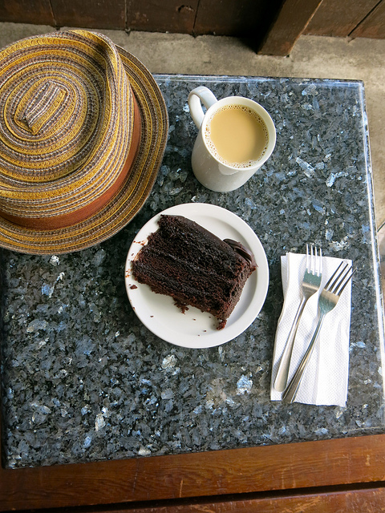

# LARA-2023_Cpp-Fork-Detection


Este repositório contém o código para detecção de garfos com a rede neural [YOLOv7-fork](https://github.com/mtsousa/LARA-2022_Fork-Detection) em C++ usando OpenCV e ONNXRunTime.

## Configuração

- Ubuntu 20.04 - WSL 2
- Versão do gcc/g++: 11.1.0
- Versão do CMake: 3.16.3
- Versão do ONNXRunTime: 1.13.1
- Versão do OpenCV: 4.2.0

### Crie o ambiente com CMake

```bash
cmake -S . -B build
```
## Como usar

### Compilar o código

```bash
(cd build/ && make)
```

### Executar o código

[`fork_best_640x640.onnx`](https://github.com/mtsousa/LARA-2022_Fork-Detection/releases/download/v0.1/fork_best_640x640.onnx)
[`fork_best_640x480.onnx`](https://github.com/mtsousa/LARA-2022_Fork-Detection/releases/download/v0.1/fork_best_640x480.onnx)


```bash
./main [MODEL] [INPUT] <optional>[OUTPUT]
```

**MODEL**: Caminho para o modelo;

**INPUT**: Caminho para a imagem de entrada; e

**OUTPUT**: Caminho para a imagem de saída (opcional).

- Exemplo

```bash
./main fork_best_640x640.onnx fork1.jpg fork1_pred.jpg
```

## Resultados

|       Original        |          Predição          |
|:---------------------:|:--------------------------:|
|  |  |